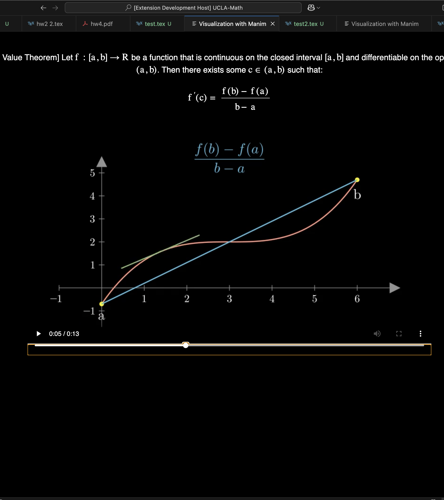

# manim-extension

`manim-extension` is a Visual Studio Code (VSCode) extension designed to bring abstract math concepts to life through intuitive animations. By leveraging the powerful `manim` Python package, this extension allows users to visualize LaTeX code directly from the VSCode environment. It automatically generates robust Manim code, which can then be used to render high-quality mathematical animations.

## Features
- **LaTeX to Animation**: Select LaTeX code in your VSCode environment and generate corresponding animations.
- **Manim Code Generation**: The extension uses Gemini to parse and understand the LaTeX statements, converting them into robust Manim code that can be rendered into animations.
- **VSCode Tab Visualization**: The generated animation is displayed within a dedicated tab in the VSCode environment for easy viewing and adjustments.
- **Easy Integration**: Seamlessly integrates into your VSCode workflow, bringing complex mathematical concepts to life with minimal effort.

## Technologies Used
- **VSCode API**: The extension is built using the VSCode API to provide a smooth and intuitive user experience within the VSCode editor.
- **JavaScript**: Handles the frontend logic of the extension, including interaction with the VSCode environment.
- **Python**: Utilized for the backend, interfacing with the Manim library to generate animations.
- **Gemini API**: Parses and interprets LaTeX code, ensuring the statements are properly understood and translated into Manim-compatible code.
- **Manim**: The popular Python library used to generate high-quality animations of mathematical concepts.

## Usage

1. Select LaTeX code within your VSCode environment.
2. Use the extension to generate the corresponding Manim code for visualization.
3. The animation will appear in a dedicated VSCode tab, where you can adjust it and view the results.

## Example

After selecting LaTeX code like:

```latex

\begin{theorem}[Mean Value Theorem]
Let \( f : [a, b] \to \mathbb{R} \) be a function that is continuous on the closed interval \([a, b]\) and differentiable on the open interval \((a, b)\). Then there exists some \( c \in (a, b) \) such that:

\[
f'(c) = \frac{f(b) - f(a)}{b - a}
\]
\end{theorem}

```

Right click, and click the `Visualize with Manim` button in the menu. After a few moments, VSCode will open at tab named "Visualization with Manim" that displays the selected lines, and a video explaining the geometric and visual intuition behind the math. 



## Installation
Clone the repository onto your local machine
```bash
git clone https://github.com/azh05/manim-extension.git
cd manim-extension
```

To install the relevant packages for the VSCode Interface: 

```bash
cd manim-gen
npm install
```

To install the relevant python packages, create a virtual environment in the root package (make sure you have `pip` installed)

```bash
# Return to the root package 
cd .. 

# Create a virtual environment named manim-extenison
python -m venv manim-extension

# On macOS/Linux
source manim-extension/bin/activate

# On windows
manim-extension\Scripts\activate

# Install relevant packages
pip install manim google-generativeai numpy
```

`manim` uses FFmpeg. Consult https://ffmpeg.org/download.html for installation details. 

You must also have a `GEMINI_API_KEY` in your local environment. Once a key is obtained from https://ai.google.dev/gemini-api/docs/api-key, run 
```bash 
export GEMINI_API_KEY="your-api-key-here"
```

Finally, to use the extension locally, open the `manim-gen` directory in VSCode, and press `f5`. This will open a new VSCode Editor with the added functionality. 